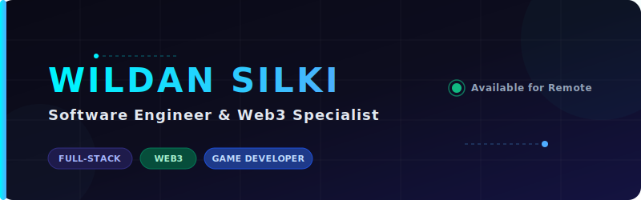

  

 

  <h3>✨ Professional Software Engineer & Web3 Specialist from Indonesia 🇮🇩</h3>
  
Building high-performance, decentralized, and user-centric digital solutions.

  

    <a href="https://www.wildansilki.xyz"><b>🌐 Portfolio Website</b></a> •
    <a href="https://www.linkedin.com/in/wildan-silki-69768a272/"><b>💼 LinkedIn</b></a> •
    <a href="https://www.instagram.com/project_silki"><b>📸 Instagram</b></a>
  

  

---

### 🚀 About Me

I am a highly motivated **Software Engineer & Web3 Specialist** based in East Java, Indonesia. I specialize in Full-Stack web development, decentralized applications, and algorithmic trading systems. My passion lies in engineering robust backend infrastructures, responsive frontends, and bridging complex technology with clean, intuitive designs.

- 🏆 **International Award Winner:** Won **2nd Place** at the **International Code Olympiad 2023** in Game Development, receiving official provincial recognition from the *Acting Governor of East Java*.
- 💼 **Professional Experience:** Former Full-Stack Developer at **PT Merkle Inovasi Teknologi**, focusing on dashboard profiling and backend APIs.
- 🎓 **Education:** Currently pursuing Computer Science at **UISI** (*Universitas Internasional Semen Indonesia*); Alumnus of **SMK Telkom Malang**.
- 🤖 **Interests & Fields:** Smart Contract Development, Algorithmic Trading (Pine Script), Embedded AI (NVIDIA Jetson Nano), and Mobile Apps.

---

### 💻 Tech Stack & Skills

| Category | Technologies |
| :--- | :--- |
| **Frontend & Mobile** |      |
| **Backend & Web3** |     |
| **Databases & Tools** |      |
| **Trading & Automation**|  |

---

### 🏅 Certifications & Credentials

- 📱 **Junior Mobile Programmer** — *Telkom Indonesia*
- 🔗 **Blockchain Basics & Smart Contracts** — *Cyfrin Updraft*
- ⚡ **DOT Certificate of Competency** — *DOT Indonesia*
- 💡 **Rapid Developer Certification** — *Mendix*
- 🧠 **AI & Embedded Systems** — *NVIDIA Jetson Nano* / *OpenUSD Model Kinds*

---

### 📊 GitHub Activity & Metrics

  <table border="0" cellpadding="0" cellspacing="0">
    <tr>
      <td valign="top" width="50%">
        
      </td>
      <td valign="top" width="50%">
        
      </td>
    </tr>
  </table>

---

### 📬 Connect With Me

Let's discuss Web3, Full-Stack applications, or Algorithmic Trading! I'm open to remote collaborations and challenging global opportunities.

  
  
  
  

