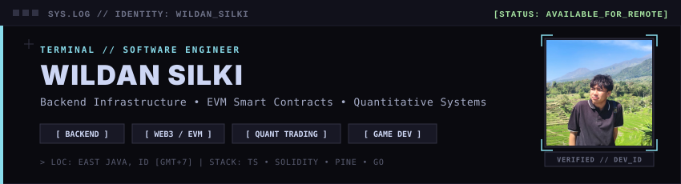

  

 

  

    <code>SYS.LOG // BACKEND INFRASTRUCTURE • EVM SMART CONTRACTS • QUANT SYSTEMS</code>
  

  

    
    
    
    
  

---

### [01] System Overview

- **Production Engineering:** Former Backend Developer at **PT Merkle Inovasi Teknologi** — built scalable RESTful APIs, data profiling pipelines, and dashboard services.
- **International Recognition:** **2nd Place Winner** at the **International Code Olympiad 2023** (Game Development), awarded official provincial honors by the *Acting Governor of East Java*.
- **Academic Foundation:** Computer Science at **Universitas Internasional Semen Indonesia (UISI)**; Alumnus of **SMK Telkom Malang**.
- **Domain Specialization:** Distributed backend architectures, EVM smart contracts, quantitative trading scripts in Pine Script, and embedded AI.

---

### [02] Projects & Core Focus

| Domain | Description & Implementation | Stack |
| :--- | :--- | :--- |
| **Web3 & Smart Contracts** | Decentralized protocols, token vendors, ERC-721 token standards, and EVM integration | `Solidity` `Hardhat` `Ethers.js` `Ethereum` |
| **Backend & Architecture** | High-throughput REST API services, data profiling pipelines, and robust authentication | `Node.js` `Express` `TypeScript` `PostgreSQL` |
| **Algorithmic Trading** | Quantitative trading models, custom Pine Script indicators, and automated execution | `Pine Script` `TradingView` `Python` |
| **Mobile & Computer Vision**| Cross-platform applications with biometric/facial recognition, geolocation, and edge AI | `Flutter` `Firebase` `NVIDIA Jetson` |

---

### [03] Tech Matrix

| Category | Technologies |
| :--- | :--- |
| **Languages** | `TypeScript` `JavaScript` `Solidity` `Go` `Python` `Dart` `SQL` |
| **Backend & Web3** | `Node.js` `Express.js` `Next.js` `React` `Hardhat` `Ethers.js` `Web3.js` |
| **Databases & Infrastructure** | `PostgreSQL` `MongoDB` `Redis` `Docker` `Linux` `Git` |
| **Specialized Systems** | `Pine Script` `TradingView` `OpenCV / Jetson Nano` `Flutter` |

---

### [04] Verified Credentials

- **Blockchain Basics & Smart Contracts** — *Cyfrin Updraft*
- **Junior Mobile Programmer** — *Telkom Indonesia*
- **Rapid Developer Certification** — *Mendix*
- **AI on NVIDIA Jetson Nano** — *NVIDIA*
- **Certificate of Competency** — *DOT Indonesia*

---

### [05] GitHub Telemetry

  <table border="0" cellpadding="0" cellspacing="0">
    <tr>
      <td valign="top" width="50%">
        
      </td>
      <td valign="top" width="50%">
        
      </td>
    </tr>
  </table>

---

  <code>STATUS: AVAILABLE FOR REMOTE ROLES • CONTRACT ENGINEERING • TECHNICAL COLLABORATION</code>
   
  SYS.LOG // WILDAN SILKI SAWABIQIL ABROOR

